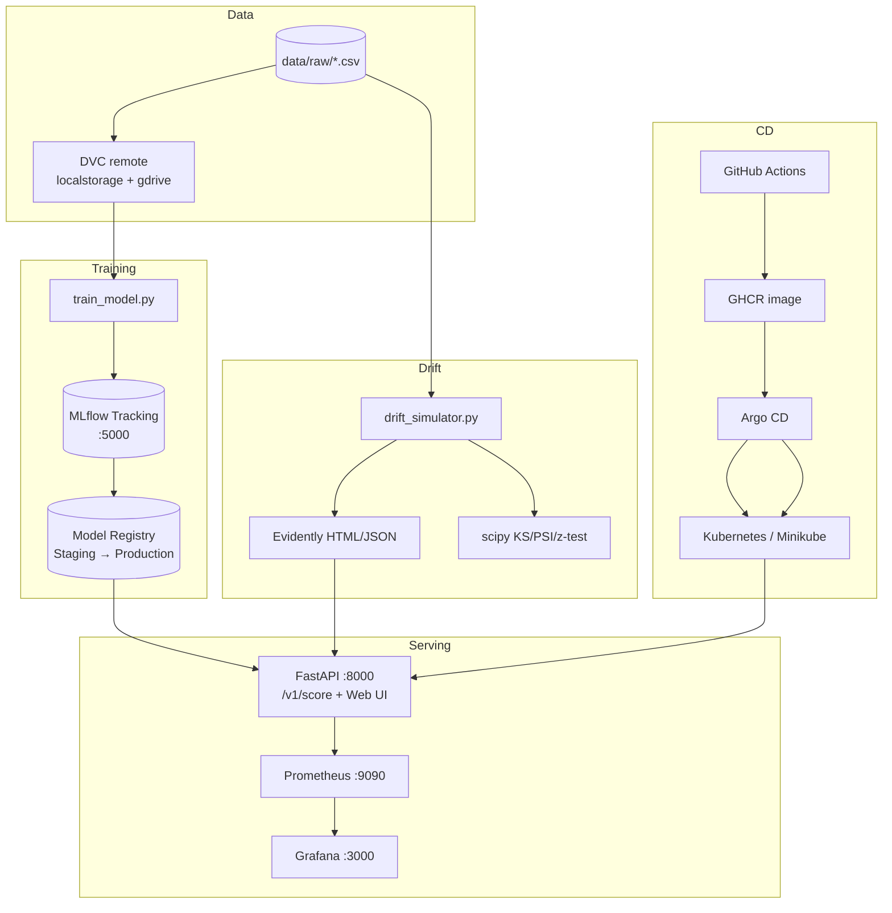

[](https://github.com/nottmv/credit_scoring/actions/workflows/ci.yml)

# Credit Scoring — MLOps система

Полный цикл MLOps: **данные → обучение → регистрация модели → сервинг → мониторинг дрейфа → переобучение → GitOps-деплой**.

---

## Архитектура



| Компонент | Технология | Назначение |
|-----------|------------|------------|
| Датасет | Kaggle *Give Me Some Credit* (150k, 10 признаков) | `Delinquent90` — дефолт 90+ дней |
| Модель | **CatBoostClassifier** (основная), XGBoost (альтернатива) | ROC-AUC / Gini, early stopping |
| Версионирование | Git (GitHub Flow) + DVC | Код + данные/модели |
| Эксперименты | MLflow 3.x | Метрики, артефакты, Registry |
| Дрейф | **Evidently AI** + scipy (KS, PSI, z-test) | HTML + JSON отчёты |
| Мониторинг | Prometheus + Grafana | Метрики API и дрейфа |
| CI/CD | GitHub Actions + Argo CD | lint → test → docker → GitOps |
| Шаблон | [Cookiecutter Data Science](https://drivendata.github.io/cookiecutter-data-science/) | `src/`, `data/`, `models/`, `reports/` |

**Почему CatBoost:** устойчив к пропускам, хорошо работает на табличных данных без тяжёлого feature engineering, встроенная регуляризация и early stopping — стандарт для credit scoring baseline.

**Почему Evidently:** готовые HTML-отчёты data drift + интеграция с учебным стеком; scipy-метрики сохранены для unit-тестов и Prometheus.

**Git flow:** [GitHub Flow](https://docs.github.com/en/get-started/using-github/github-flow) — защищённая ветка `master` (или `main`), feature/fix-ветки, merge через PR с зелёным CI и Conventional Commits.

---

## Быстрый старт (с нуля)

### 1. Клонирование и окружение

```bash
git clone https://github.com/nottmv/credit_scoring.git
cd credit_scoring
python3 -m venv .venv && source .venv/bin/activate
pip install -U pip setuptools wheel
pip install -r requirements.txt
```

### 2. Данные

**A — DVC (рекомендуется):**
```bash
dvc pull -r localstorage          # локальный remote (.dvc-storage)
# или полный датасет:
pip install 'dvc[gdrive]' && dvc pull -r mlops
```

**B — синтетические данные (без авторизации):**
```bash
# уже в репозитории: data/raw/synthetic_min.csv (~800 строк)
make train
```

**C — Google Drive:**
```bash
make fetch-data
```

### 3. Обучение

```bash
make train                        # CatBoost → models/model_bundle_catboost.pkl
make train-mlflow                 # + логирование в MLflow (нужен сервер)
```

### 4. Локальный стек (без Docker)

```bash
make local-up
# API:     http://127.0.0.1:8000/docs
# Dashboard: http://127.0.0.1:8000/dashboard
# MLflow:  http://127.0.0.1:5000
```

### 5. Docker Compose (полный стек)

```bash
make train
make docker-up
```

| Сервис | URL | Логин |
|--------|-----|-------|
| API / Swagger | http://localhost:8000/docs | — |
| Dashboard | http://localhost:8000/dashboard | admin token при retrain |
| Evidently отчёт | http://localhost:8000/reports/drift.html | — |
| MLflow | http://localhost:5001 | — |
| Prometheus | http://localhost:9090 | — |
| Grafana | http://localhost:3000 | admin / admin |

**Drift simulator** (сервис `drift-simulator` в compose) каждые 30 с генерирует сдвинутый batch и обновляет метрики — на дашборде Grafana видны растущие PSI и `credit_drift_score`.

### 6. DVC pipeline

```bash
# drift_check: reference vs data/incoming/current.csv → reports/
PATH="$(pwd)/.venv/bin:$PATH" dvc repro drift_check
dvc push -r localstorage
dvc pull -r localstorage
```

---

## Переменные окружения

| Переменная | По умолчанию | Описание |
|------------|--------------|----------|
| `MODEL_PATH` | `models/model_bundle_catboost.pkl` | Путь к bundle (fallback если нет Registry) |
| `MLFLOW_TRACKING_URI` | — | URI MLflow (docker: `http://mlflow:5000`) |
| `MLFLOW_MODEL_URI` | — | `models:/credit_scoring_catboost/Production` |
| `ADMIN_RELOAD_TOKEN` | — | Токен для `/internal/retrain` и reload |
| `DRIFT_REPORT_PATH` | `reports/last_drift.json` | JSON drift |
| `EVENTS_JSONL_PATH` | `reports/events.jsonl` | Лог предсказаний |
| `DRIFT_SIM_INTERVAL` | `30` | Интервал симулятора дрейфа (сек) |

---

## API

| Метод | Маршрут | Описание |
|-------|---------|----------|
| GET | `/health` | Healthcheck |
| GET | `/docs`, `/openapi.json` | OpenAPI |
| POST | `/v1/score` | Скоринг |
| POST | `/v1/feedback` | Фидбек (y_true) |
| GET | `/v1/predictions` | Последние предсказания + anomaly |
| GET | `/v1/drift/report` | JSON drift |
| GET | `/reports/drift.html` | Evidently HTML |
| POST | `/internal/retrain` | Фоновое переобучение (X-Admin-Token) |
| GET | `/metrics` | Prometheus |

Пример инференса:
```bash
curl -X POST http://localhost:8000/v1/score \
  -H 'Content-Type: application/json' \
  -d '{"features":{"RevolvingUtilizationOfUnsecuredLines":0.3,"Age":45,"DebtRatio":0.35,"MonthlyIncome":6000,"NumberOfOpenCreditLinesAndLoans":8,"NumberOfTimes90DaysLate":0,"NumberRealEstateLoansOrLines":1,"NumberOfTime30-59DaysPastDueNotWorse":0,"NumberOfTime60-89DaysPastDueNotWorse":0,"NumberOfDependents":0}}'
```

---

## Web UI (6 элементов)

| # | Элемент | Маршрут | Реализация |
|---|---------|---------|------------|
| 1 | Инференс | `/ui/inference` | POST `/v1/score` + feedback |
| 2 | Таблица предсказаний | `/dashboard` | `events.jsonl` |
| 3 | Флаги аномалий | dashboard + API | `probability >= 0.8` |
| 4 | Переобучение | dashboard кнопка | subprocess → `retrain_pipeline.py` + MLflow |
| 5 | Эксперименты | `/ui/experiments` | MLflow REST API |
| 6 | Уведомления дрейфа | banner на dashboard | `reports/last_drift.json` → `degraded` |

---

## CI/CD

`.github/workflows/ci.yml`:
1. **lint-test** — flake8 + pytest (25 тестов)
2. **docker** — build API (+ push в GHCR на push в master/main)
3. **deploy** — обновление `k8s/prod/deployment.yaml` (GitOps для Argo CD)

PR в `master`/`main`: lint, test, docker build (без push).  
Push в `master`/`main`: полный цикл + обновление image tag.

Conventional Commits проверяются в `commitlint.yml`.

---

## Kubernetes + Argo CD

```bash
# Minikube (локально)
make minikube-deploy

# Argo CD
kubectl create namespace argocd
kubectl apply -n argocd -f https://raw.githubusercontent.com/argoproj/argo-cd/stable/manifests/install.yaml
kubectl apply -f argocd/application.yaml
kubectl get applications -n argocd
```

Манифесты: `k8s/prod/` (GHCR + MLflow Registry), `k8s/local/` (hostPath модель), `k8s/ingress.yaml`, `k8s/service.yaml` (NodePort 30800).

---

## Структура проекта (Cookiecutter DS)

```
credit_scoring/
├── src/
│   ├── api/                 # FastAPI + Jinja2 UI
│   ├── models/              # train, predict, MLflow pyfunc
│   ├── monitoring/          # drift (scipy + Evidently), Prometheus
│   ├── features/
│   └── data/
├── scripts/                 # drift_check, drift_simulator, retrain_pipeline
├── data/raw/                # credit_scoring.csv (DVC), synthetic_min.csv
├── models/                  # .pkl (DVC)
├── reports/                 # drift JSON/HTML, events.jsonl
├── monitoring/              # prometheus.yml, grafana/
├── k8s/                     # Deployment, Service, Ingress
├── argocd/                  # Application manifest
├── dvc.yaml                 # pipeline: drift_check, train
└── .github/workflows/       # ci.yml, commitlint.yml
```

---

## Тесты

```bash
make test          # pytest -q tests
make lint          # flake8
make final-check   # lint + test + compose config
```

---

## Известные ограничения

- Полный датасет (150k) — через `dvc pull -r mlops` (Google OAuth) или `make fetch-data`.
- MLflow Registry stages deprecated в MLflow 3.x — используем Staging/Production для совместимости с учебным заданием.
- Grafana в Minikube не развёрнута — используйте `docker compose` для дашбордов дрейфа.
- Argo CD sync требует доступного K8s-кластера и секрета `ghcr-secret` для pull образа.

---

## Авторы

Михаил Попов, Лия Суфиянова — ИТМО MLOps курс
